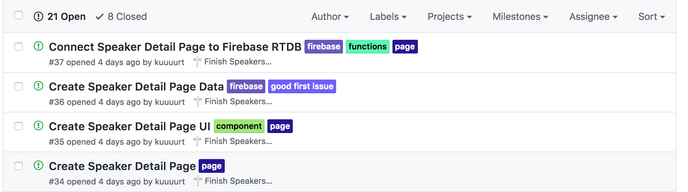
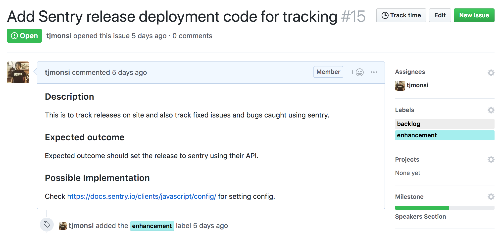

# Forking and Branching Guidelines
This section guides contributors through the naming convention and processess that will be followed when contributing fixes and enhancements to this repository. Please follow the rules at [CONTRIBUTING](../../CONTRIBUTING.md) file for basic rules on how to contribute.

## Forking the project

Go back to the top level of this [repo](https://github.com/gdgphilippines/devfest2018)

Click the "Fork" button in the upper right hand corner of the interface ([More Details Here](http://help.github.com/fork-a-repo))

After the repository (repo) has been forked, you will be taken to your copy of the repo

## Create a local clone of your fork

In your own forked repo, on the right hand side, there's a button called "Clone or Download", click on it.

If you did the [SSH](Requirements.md) section of GIT, you can copy the SSH link of the Github repo. If not, copy the HTTPS link.

Open a **Terminal** / **Command Line** / **Bash Shell** in your projects directory.

Then type the following command

```
git clone [the-link-that-you-copied]
```

Example (SSH)

```
git clone git@github.com:[yourUserName]/devfest2018.git
```

or for HTTPS

```
git clone https://github.com/[yourUserName]/devfest2018.git
```

This will then download the entire repo to your local machine


## 4 Setting up the Upstream

Navigate to your newly cloned directory

```
cd devfest2018
```

Add a remote to the official devfest2018 repo:

```
git remote add upstream https://github.com/gdgphilippines/devfest2018.git
```

(Optional) To get the latest changes from upstream

```
git checkout develop
git pull upstream develop
```

## Picking the Task / Issue that you want to fix

Now that you have a local copy on your machine, it is time to contribue.

Go back to the [issue section of the repo](https://github.com/gdgphilippines/devfest2018/issues).

Find an issue that you think you can do and click on it.



Once you went there, take note of the title and issue number. Assign it to yourself and use the comments section to ask questions if you need more information.



On your **Terminal** / **Command Line** / **Bash Shell** (make sure you are in your project folder), create a branch from develop

```
git checkout develop        # to make sure that you in develop branch
git pull upstream develop   # to pull any updates from the main develop branch
git push origin develop     # to update your own forked repo from updates from main develop branch
git checkout -b [slugified-issue-title]-#[issue-number] # this is to create a new branch with reference to your issue that you picked
git push -u origin [slugified-issue-title]-#[issue-number]
```

The last two commands, for example, given the picture, should be written like this:

```
git checkout -b add-sentry-release-deployment-code-for-tracking-#15
git push -u origin add-sentry-release-deployment-code-for-tracking-#15
```

Or if you want it short

```
git checkout -b add-sentry-#15
git push -u origin add-sentry-#15
```

## What's next?

Once you have a working branch, you can see the project structure of the repo. You can understand it more by looking at the [Project Structre page](Project-Structure.md) or you can now test out the files by [installing](Installation.md) and [running](Running.md) them or you can now go and edit and [do commits](Commit.md).

## (Optional / Advanced) Rebase

You can use Git's [interactive rebase](https://help.github.com/articles/interactive-rebase) feature to tidy up your commits making them public.